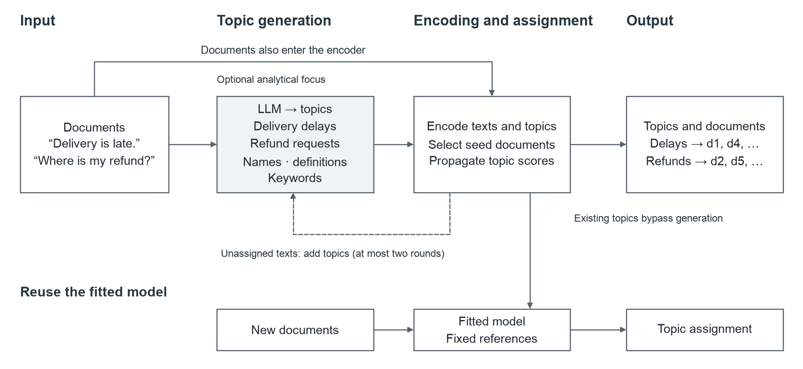
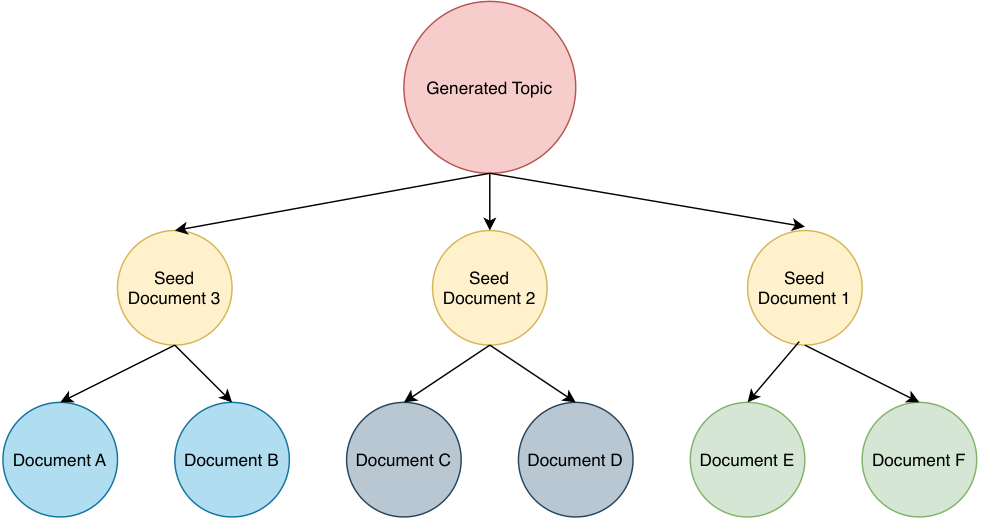

# Hybrid Topic: A Topic Modeling System Combining LLM Topic Generation and Graph Propagation

Jiashuo Ren  
University of Stirling

## Abstract

Topic modeling helps researchers discover and organize themes in text collections. Large language models can express topics as readable names and descriptions, providing a basis for interpretable and adjustable topic modeling tools. We present Hybrid Topic, a system that combines LLM topic generation, pretrained semantic embeddings, and graph-based document assignment. Topic descriptions identify representative documents, whose topic scores propagate through connections between similar documents. A bounded discovery stage adds topics for unassigned material. The fitted model can be saved and applied to new documents without further topic-generation calls. We evaluate two generators in five runs on each of four collection subsets previously used in development. The GPT-4.1 mini and Luna configurations exceed the configured BERTopic baseline in HMP on three and four collections, respectively, with document coverage of 93.88%–100%. A fixed-topic-set ablation shows an overall improvement in HMP and coverage from propagation. A prompt comparison produces fewer topics on average with compact wording, with grouping-quality effects varying across collections. A unified Python interface connects topic discovery, user-supplied topics, and subsequent document analysis, providing a reusable implementation for organizing text with natural-language topics.

**Keywords:** topic modeling, large language models, semantic embeddings, graph propagation.

## 1. Introduction

Topic modeling discovers recurring themes in a collection and organizes documents around them. Researchers use these methods to explore material such as social media comments and news, identify prominent subjects, and retrieve relevant texts for further analysis. The usefulness of this process depends on readable topics, meaningful document groups, and the ability to apply a topic scheme to subsequent material.

Existing approaches address these needs in different ways. Probabilistic topic models infer latent topics from word distributions, while embedding-based methods organize documents using pretrained semantic representations. Large language models extend topic representations to names and natural-language descriptions and allow users to express an analytical focus. Connecting these descriptions to semantic relationships among documents is a concrete design problem for topic modeling systems.

Researchers also need to work with the results after the initial analysis. Someone studying comments may read the texts assigned to a topic, export them for closer analysis, and later apply the same topics to new comments. We designed Hybrid Topic to support these steps within one system.

Recent methods have explored this combination. TopicGPT generates topics and assigns documents with language models (Pham et al., 2024). LiSA introduces generated topic information into document and topic semantic spaces and coordinates their clustering results (Liu et al., 2025). These studies show how generated information can participate in document organization. We examine a design that uses fixed pretrained representations and connections among documents to turn topic descriptions into assignments.

We introduce Hybrid Topic. An LLM discovers and names topics, an encoder places topic descriptions and documents in a shared semantic space, and graph propagation uses relationships among similar documents to assign topics. The system also accepts an analytical focus or an existing topic set and supports independent assignment of new texts after saving the fitted model. Separating topic generation from subsequent assignment allows the resulting topic scheme to remain in use as new material arrives.

We compare two generator configurations with clustering baselines on four collections and examine propagation through an ablation with the final topic set held fixed. The two configurations exceed the configured BERTopic baseline in HMP on three and four collections, respectively; propagation improves HMP and coverage overall. Our contributions are a system connecting generated topic descriptions, semantic representations, and graph assignment, together with an empirical analysis of its grouping performance, propagation contribution, and sensitivity to the generator.

## 2. Related Work

### 2.1 From word statistics to semantic representations

Probabilistic topic models infer topics from word distributions in documents. LDA represents a document as a mixture of latent topics, each associated with a distribution over words (Blei et al., 2003). This approach provides a basis for corpus exploration, although short texts contain few words and sparse co-occurrence evidence. BTM addresses this problem by modeling unordered word-pair co-occurrences across the corpus (Yan et al., 2013). These approaches establish statistical evidence for topics from word distributions and co-occurrence patterns.

Pretrained semantic representations provide another source of information. Contextualized topic models incorporate contextual document representations into neural topic modeling (Bianchi et al., 2021). BERTopic clusters document embeddings and uses class-based TF-IDF to extract representative words for each cluster (Grootendorst, 2022). Semantic representations can bring differently worded but related texts together in an embedding space. These approaches retain different applications and assumptions, while pretrained encoders also offer a direct way to connect topic descriptions with document relationships.

### 2.2 LLM-assisted topic modeling

LLMs extend topics to names, definitions, and other natural-language descriptions and allow users to express analytical requirements through prompts. TopicGPT organizes this process into topic generation, refinement, and document assignment, with quotations supporting assignments. Its study reports improved alignment with human categories and demonstrates user control over the resulting topics (Pham et al., 2024). Topics thus become explicit descriptions that analysts can inspect and adjust.

Generated information can also guide semantic clustering. LiSA generates candidate topic words, constructs document and topic semantic spaces, uses an LLM to coordinate conflicting assignments, and trains prediction networks to align the spaces. It reports stronger topic alignment than the evaluated GPT-4-based methods and competitive topic quality against neural topic models (Liu et al., 2025). Hybrid Topic also uses generated topic information to organize documents; its assignment stage propagates scores over fixed representations.

### 2.3 Graph relationships and topic assignment

Document-to-topic similarity provides direct semantic evidence, while relationships among documents provide additional assignment cues. Graph-based semi-supervised learning propagates information through sample neighborhoods to encourage predictions consistent with the data structure (Zhou et al., 2003). In topic modeling, HAMLET combines language models, semantic embeddings, and graph neural networks for cross-lingual healthcare topic modeling and refinement of topic representations (Sakai & Lam, 2025).

Hybrid Topic selects seed documents by their similarity to generated topics and passes their topic scores to similar documents. We refer to this repeated transfer of scores as graph propagation, or diffusion. The encoder remains fixed throughout. The propagation experiment tests whether information from neighbouring documents improves assignment.

The design uses two semantic relationships at different stages. Document-to-topic similarity determines where initial topic information is placed; document-to-document similarity determines how it travels. Generated topics provide semantic starting points for the graph, and corpus relationships participate in the resulting groups. This separation also allows propagation to be examined with topic descriptions and representations held fixed.

### 2.4 Evaluating topic models

Topic evaluation concerns both topic content and document grouping. Coherence measures assess associations among topic words, while human evaluation can examine whether topics are readable, specific, and useful for understanding a corpus. Hoyle et al. (2021) find that coherence-based rankings can differ from human judgments. Li et al. (2025) show that readable LLM descriptions can still be too broad. The analytical value of natural-language topics therefore also depends on the task in which they are used.

External clustering measures compare assignments with reference categories. Set-matching F measures match each reference category to the predicted group with the best combined precision and recall, then weight by category size (Amigó et al., 2009); we denote this particular form by HMP. ARI measures agreement on document pairs with a correction for chance (Hubert & Arabie, 1985). NMI measures shared information between partitions with normalization (Vinh et al., 2010). They provide complementary views of document grouping.

We use HMP as the main measure and ARI and NMI as supporting measures. Coverage, the proportion of documents assigned a topic, additionally describes the assignment reach of systems that can leave documents unassigned. Section 4.4 explains their calculation and the treatment of unassigned documents.

## 3. System and Method

### 3.1 Overview

Given an induction corpus, Hybrid Topic constructs a topic set and assigns topics to documents. Each topic comprises a name, definition, and keywords; together they form the topic codebook. Each document receives a topic ID or −1 if unassigned. Users may supply an analytical focus or an existing topic set. The generator and encoder retain their pretrained weights.

*Figure 1. Hybrid Topic overview. Documents and topic descriptions both enter semantic encoding and graph assignment; user-supplied topics bypass generation. Unassigned induction documents can trigger bounded topic discovery. New documents receive independent assignments from the fitted model. The cards show example topics and documents.*

### 3.2 Topic generation

The generator reads a collection of documents and proposes a set of recurring topics. The prompt asks it to decide the number of topics and provide a name, definition, and keywords for each one. The following excerpt states this requirement in the requests used in our experiments:

> Discover a compact set of recurring topics yourself. Each topic must provide a name, definition, and all useful core_keywords.

The word “compact” encourages a concise overview of the collection, with broader topics that are easy to browse. “Recurring” directs attention to themes shared by multiple documents. This wording gives the generator a preference for summarisation while leaving the number of topics open. We use it as the default and examine a more neutral wording in Section 5.4.

The request specifies a structured JSON response containing a topic identifier and these three fields. The system checks that the fields are present and valid before encoding the descriptions. Reference labels, benchmark categories, and a target topic count are excluded from the generation input. The model therefore identifies the topics and their level of detail from the supplied texts.

The three topic fields describe different aspects of its meaning. The name gives a short label, the definition explains what the topic covers, and the keywords provide typical expressions. For a topic named “Delivery delays,” the definition might cover packages arriving later than expected, with keywords such as delivery, tracking, and waiting. The encoder receives the combined description when selecting documents for that topic.

Users can provide an analytical focus as additional context in the prompt. For example, they can ask the generator to focus on complaints in a collection of product comments. Users with an existing classification scheme can supply topic names, definitions, and keywords directly. Both approaches produce the same topic representation for document assignment.

All candidate documents are sent to the generator when they fit the input budget. Otherwise, the system selects complete documents in a fixed random order within that budget. Documents omitted from generation still participate in encoding and assignment. Every generation call in these experiments included all its candidate documents. The full prompt, input budget, and format-retry rules appear in the supplementary material.

### 3.3 Graph-based document assignment

Document assignment starts by finding texts that closely match each generated topic. The system combines the topic name, definition, and keywords, then encodes this description and the documents with the same semantic encoder. Cosine similarity measures how close their meanings are. For each topic, the five most similar documents become seeds. A seed receives its nonnegative similarity score for that topic; other documents start with a score of zero. A document can be selected as a seed for more than one topic.

The system also compares the documents with one another and connects those with sufficiently similar meanings. Each document is a node, and the connections form the document graph. More similar neighbours contribute more strongly when the system updates a document's topic scores. Section 4.2 gives the threshold and update settings.

*Figure 2. Topic scores pass from selected seed documents to similar documents. The upper arrows show seed selection for one generated topic; the lower arrows show propagation to neighbouring documents. Colours in the bottom row distinguish the document groups around the three illustrated seeds.*

Figure 2 shows how a generated topic reaches documents through its seeds. The topic first identifies texts that express its meaning closely. Their scores then pass through the connections between similar documents. For instance, a comment about an overdue package may be selected for a delivery-delay topic. A related comment about tracking updates can receive a score for the same topic through its connection to that seed. Subsequent updates allow the information to reach documents further along the graph.

At each update, the system combines the weighted average of neighbours' topic scores with the document's initial seed scores. Retaining the initial scores keeps the propagation connected to the generated topics. Updates continue until the scores change very little or the configured number of updates is reached. Each document is assigned to its highest-scoring topic if that score is positive. Documents with no positive score remain unassigned. The same process runs across all topics, allowing their scores to be compared for each document.

Unassigned documents can contain themes missing from the initial topic set. When at least two remain, the generator receives them together with the full current topic list. The prompt asks for recurring themes absent from that list and instructs the model to preserve existing topics. The system checks proposed additions for duplicates, adds valid topics, and repeats assignment using the saved document vectors and similarities. It allows at most two additional rounds and stops early when no valid topic is added or another stopping condition is reached. The full prompt and stopping rules appear in the supplementary material. Users who supply their own topic set proceed directly to assignment.

### 3.4 New-document assignment and reuse

The fitted model saves the reference document vectors, their final topic scores, and the similarity threshold. For each new document, it finds reference documents with positive similarity that reaches this threshold. It takes a similarity-weighted average of their topic scores and multiplies the result by the propagation rate. The highest positive score determines the assigned topic. A document remains unassigned when it receives no positive score.

Each incoming document uses the same saved references independently. With consistent, deterministic encoding and preprocessing, a document receives the same assignment whether it is submitted alone or alongside other texts. This allows a researcher to apply an established topic set to material collected later. Topic generation is required when discovering the scheme; subsequent assignments use the saved model and encoder.

### 3.5 System workflow

An analysis starts with a text collection in Python or Jupyter. After configuring the generator and encoder, the user fits the model and obtains a topic table and document assignments. The topic table reports names, definitions, keywords, and document counts. The document table links individual texts to their assignments, allowing the researcher to read the material grouped under each topic.

A researcher studying news can first examine the main subjects in the collection and then read the articles assigned to a selected topic. Exported tables support further sorting and analysis, while the saved model allows later articles to be organised under the same scheme. Automatic discovery, an analytical focus, and a supplied topic set share this inspection and reuse procedure. The repository provides installation instructions and complete Python examples.

## 4. Experimental design

### 4.1 Collections and provenance

Table 1 describes the fixed subsets. Bills comes from the TopicGPT research repository (Pham et al., 2024).<!--ref:pham2024topicgpt--><!--anchor:section:4.1--> SIB-200 is a multilingual topic-classification resource (Adelani et al., 2024).<!--ref:adelani2024sib200--><!--anchor:section:Abstract--> MASSIVE contains multilingual assistant utterances (FitzGerald et al., 2022).<!--ref:fitzgerald2022massive--><!--anchor:section:Abstract--> We use the SetFit scenario versions for Chinese and English. AG News uses the text-classification benchmark associated with Zhang et al. (2015).<!--ref:zhang2015character--><!--anchor:section:4--> 

*Table 1. Induction and test collections. Counts describe the preserved experiment inputs. Eligible test counts determine all primary result tables.*

| Collection | Material | Induction texts | Test texts | Eligible test texts |
|---|---|---:|---:|---:|
| Bills | Legislative texts, preserved TopicGPT subset | 272 | 376 | 376 |
| SIB-200 | Chinese/English topic-classification texts | 210 | 140 | 140 |
| MASSIVE | Chinese/English assistant utterances, scenario labels | 540 | 360 | 360 |
| AG News | News-classification texts | 1,200 | 800 | 799 |

Subsets were balanced using reference categories. SIB-200 and MASSIVE pooled Chinese and English before sampling thirty induction and twenty test records per category with seed eleven, without enforcing equal language counts. Bills retained categories meeting the specified minimum-count rule. Acquisition paths and data revisions are listed in the [reproduction instructions](../docs/REPRODUCIBILITY.md).

One AG News test text is excluded from primary scoring under the previously fixed overlap rule. The rule screens character five-gram TF-IDF similarities of at least 0.70, then excludes pairs with five-gram Jaccard similarity of at least 0.80. Scores including all 800 test documents are available in the supplementary results.

The generator receives no reference labels. Predictions are completed before evaluation against labels. The four collections were previously used in development; this experiment evaluates held-out assignment within the retained induction/test splits.

### 4.2 Models and shared settings

The generators are GPT-4.1 mini (`gpt-4.1-mini-2025-04-14`) and Luna (`gpt-5.6-luna`, with `low` reasoning effort). Each configuration is run five times per collection, giving forty fits. Both use the same default assignment parameters; repeated generation captures output variation.

All comparisons share document vectors from Qwen3-Embedding-0.6B (Qwen, n.d.); generated topic descriptions are encoded separately for each run. Encoder inputs are limited to 512 tokens, and test documents are encoded individually. The graph retains connections at or above the 95th percentile of similarities between different documents, with self-connections removed and each positive row divided by its sum. This percentile threshold adjusts to the similarity distribution of each collection and keeps approximately the strongest 5% of document pairs; ties can change this proportion slightly. It concentrates propagation on close semantic relationships. The 95th percentile was fixed during development as an empirical default and used across all four collections. There are five seeds per topic. Each update combines 70% neighbouring scores and 30% initial scores, stopping after ten updates or when the largest absolute change is at most 0.000001. Topic supplementation is limited to two rounds. Generation budgets and full run configurations are provided in the supplementary material.

### 4.3 Baselines and component comparisons

The primary baselines are BERTopic and topic-count-matched KMeans. KMeans uses ten initializations and sets its cluster count to the final topic count of the corresponding Hybrid run. BERTopic uses UMAP with cosine distance, five components, fifteen neighbors, and zero minimum distance; HDBSCAN uses a minimum cluster size of ten with prediction enabled. The two generator configurations share the same twenty BERTopic baseline runs; their KMeans baselines are fitted at the corresponding topic counts.

The propagation ablation fixes the final topic set, document and topic vectors, seed matrix, similarity threshold, and new-document query rule for each run. Propagation-on uses final reference scores; propagation-off uses initial seed scores. Both use identical score scaling and positive-score assignment rules. Two generators, four collections, and five runs per collection yield forty paired comparisons.

Supplementary analyses compare nearest-topic cosine assignment and assignment before and after topic supplementation. Nearest-topic assignment uses the same topic set as its corresponding run and always selects a topic. The supplementation comparison uses the initial and final topic sets of the same fit. Full settings and results are supplied in the supplementary material.

### 4.4 Evaluation measures

The main measure, HMP, compares each reference category with the predicted groups and selects its best match (Amigó et al., 2009, Section 4.1). For each possible match, precision describes how much of the predicted group belongs to that reference category, while recall describes how much of the category the group contains. F1 combines precision and recall through their harmonic mean. HMP averages the best F1 for each category, weighted by the number of documents in that category.

Coverage is the proportion of documents assigned a topic. ARI compares agreement on document pairs, with a correction for chance. NMI measures the information shared by the reference categories and predicted groups; we use the arithmetic mean of their entropies for normalization. These measures describe different aspects of the output: HMP, ARI, and NMI assess grouping, while coverage shows how much of the collection receives an assignment.

Full-test-set scoring treats −1 as a shared predicted group, so HMP is reported alongside coverage. Tables present means and sample standard deviations across five runs; propagation comparisons are paired within runs. Scores on the jointly assigned subset are supplementary diagnostics. Complete per-run metrics appear in the supplementary material.

## 5. Results

### 5.1 Document grouping and coverage

Table 2 reports HMP and coverage for the primary comparison. GPT-4.1 mini exceeds the configured BERTopic baseline in mean HMP on Bills, SIB-200, and AG News; Luna exceeds it on all four collections. Both configurations reach coverage between 0.9388 and 1.0000, above BERTopic on SIB-200, MASSIVE, and AG News. On Bills, their coverage is 0.9388 against BERTopic's 0.9750.

*Table 2. Primary results, mean ± sample SD across five runs. BERTopic is a shared baseline; KMeans topic counts match the corresponding generator configuration.*

<!-- main-table:start -->
| Collection | Configuration | HMP | Coverage |
|---|---|---:|---:|
| Bills | Hybrid / GPT-4.1 mini | 0.3647 ± 0.0301 | 0.9388 ± 0.0000 |
| Bills | Hybrid / Luna | 0.4181 ± 0.0154 | 0.9388 ± 0.0000 |
| Bills | BERTopic (shared) | 0.1603 ± 0.0330 | 0.9750 ± 0.0559 |
| Bills | KMeans / GPT-4.1 mini K | 0.4075 ± 0.0289 | 1.0000 ± 0.0000 |
| Bills | KMeans / Luna K | 0.4172 ± 0.0297 | 1.0000 ± 0.0000 |
| SIB-200 | Hybrid / GPT-4.1 mini | 0.5009 ± 0.0442 | 0.9643 ± 0.0000 |
| SIB-200 | Hybrid / Luna | 0.4759 ± 0.0145 | 0.9643 ± 0.0000 |
| SIB-200 | BERTopic (shared) | 0.2543 ± 0.0055 | 0.0657 ± 0.0340 |
| SIB-200 | KMeans / GPT-4.1 mini K | 0.5226 ± 0.0531 | 1.0000 ± 0.0000 |
| SIB-200 | KMeans / Luna K | 0.5066 ± 0.0440 | 1.0000 ± 0.0000 |
| MASSIVE | Hybrid / GPT-4.1 mini | 0.4896 ± 0.0310 | 0.9500 ± 0.0000 |
| MASSIVE | Hybrid / Luna | 0.6608 ± 0.0236 | 0.9500 ± 0.0000 |
| MASSIVE | BERTopic (shared) | 0.5867 ± 0.0320 | 0.6922 ± 0.0297 |
| MASSIVE | KMeans / GPT-4.1 mini K | 0.5769 ± 0.0424 | 1.0000 ± 0.0000 |
| MASSIVE | KMeans / Luna K | 0.6760 ± 0.0149 | 1.0000 ± 0.0000 |
| AG News | Hybrid / GPT-4.1 mini | 0.7177 ± 0.0454 | 1.0000 ± 0.0000 |
| AG News | Hybrid / Luna | 0.6262 ± 0.0513 | 1.0000 ± 0.0000 |
| AG News | BERTopic (shared) | 0.5692 ± 0.0606 | 0.6889 ± 0.1037 |
| AG News | KMeans / GPT-4.1 mini K | 0.6102 ± 0.0759 | 1.0000 ± 0.0000 |
| AG News | KMeans / Luna K | 0.4795 ± 0.0502 | 1.0000 ± 0.0000 |
<!-- main-table:end -->

Both generator configurations exceed topic-count-matched KMeans in HMP on AG News; Luna is also slightly higher on Bills. KMeans obtains higher HMP in the other combinations and assigns every document. Nearest-topic assignment is also competitive on some collections; its complete results appear in the supplementary material.

### 5.2 Contribution of graph propagation

With the topic set fixed, propagation improves HMP and coverage overall (Table 3). Both generators improve in mean HMP on AG News, MASSIVE, and SIB-200, while Bills is approximately unchanged. Coverage increases in every combination.

*Table 3. Fixed-topic-set propagation ablation. HMP is mean ± sample SD across five runs; coverage entries are five-run means. Coverage SD and per-run paired results appear in the supplementary material.*

<!-- propagation-table:start -->
| Generator | Collection | HMP off | HMP on | Coverage off → on |
|---|---|---:|---:|---:|
| GPT-4.1 mini | Bills | 0.3640 ± 0.0246 | 0.3647 ± 0.0301 | 0.7755 → 0.9388 |
| GPT-4.1 mini | SIB-200 | 0.4859 ± 0.0374 | 0.5009 ± 0.0442 | 0.6986 → 0.9643 |
| GPT-4.1 mini | MASSIVE | 0.4548 ± 0.0288 | 0.4896 ± 0.0310 | 0.7211 → 0.9500 |
| GPT-4.1 mini | AG News | 0.5382 ± 0.0443 | 0.7177 ± 0.0454 | 0.7697 → 1.0000 |
| Luna | Bills | 0.4228 ± 0.0313 | 0.4181 ± 0.0154 | 0.8596 → 0.9388 |
| Luna | SIB-200 | 0.4490 ± 0.0191 | 0.4759 ± 0.0145 | 0.8100 → 0.9643 |
| Luna | MASSIVE | 0.6370 ± 0.0200 | 0.6608 ± 0.0236 | 0.8428 → 0.9500 |
| Luna | AG News | 0.4823 ± 0.0338 | 0.6262 ± 0.0513 | 0.8583 → 1.0000 |
<!-- propagation-table:end -->

AG News shows the largest mean HMP gains: 0.1795 with GPT-4.1 mini and 0.1438 with Luna. MASSIVE gains are 0.0347 and 0.0238, respectively. Both collections improve in all five runs with each generator. Mean coverage gains range from 7.93 to 26.57 percentage points. Results for the jointly assigned subset are provided in the supplementary material.

### 5.3 Effect of the generator

Luna obtains higher HMP on Bills and MASSIVE, while GPT-4.1 mini is higher on SIB-200 and AG News. Coverage is identical between generators within each collection. The relative performance of the generators therefore depends on the collection.

Saved outputs from MASSIVE illustrate changes in the topic sets. Final topic counts across the five GPT-4.1 mini runs are 11, 11, 11, 11, and 14; the corresponding Luna counts are 24, 28, 22, 28, and 24. In the first paired run in the scheduled order, GPT-4.1 mini’s “Alarms and Reminders” covers alarms, reminders, and calendar events. Luna separates alarms and timed reminders from calendars, meetings, and scheduled events. GPT-4.1 mini also combines news updates and social-media operations in “News and Social Media,” whereas Luna describes them as separate topics. These outputs show concrete changes in topic scope and granularity. Original descriptions and run identifiers appear in the supplementary material.

Additional topic discovery has a small effect on these test results, with no change in coverage before and after supplementation. Complete initial/final topic-set comparisons appear in the supplementary material.

### 5.4 Effect of the topic-generation prompt

We compared the compact prompt used in the main experiment with a neutral alternative: “Identify the recurring topics in the documents. Let the content of the documents guide the number and specificity of the topics. For each topic, provide a name, a definition, and relevant core keywords.” We repeated all forty fits with the same collections, seeds, generation settings, assignment procedure, and scoring method. Table 4 reports the final topic counts, including any topics added during supplementation, and HMP averaged over five runs.

*Table 4. Topic count and HMP under compact and neutral prompts. Each entry is a five-run mean. Full run-level results, sample standard deviations, coverage, ARI, NMI, and all comparison methods are available in the supplementary material.*

| Generator | Collection | Topics: compact | Topics: neutral | HMP: compact | HMP: neutral |
|---|---|---:|---:|---:|---:|
| 4.1 mini | Bills | 13.6 | 16.8 | 0.3647 | 0.3938 |
| 4.1 mini | SIB-200 | 9.8 | 10.2 | 0.5009 | 0.4889 |
| 4.1 mini | MASSIVE | 11.6 | 21.0 | 0.4896 | 0.5981 |
| 4.1 mini | AG News | 10.6 | 11.6 | 0.7177 | 0.6825 |
| 5.6 Luna | Bills | 21.8 | 25.0 | 0.4181 | 0.4316 |
| 5.6 Luna | SIB-200 | 16.0 | 19.0 | 0.4759 | 0.4707 |
| 5.6 Luna | MASSIVE | 25.2 | 28.0 | 0.6608 | 0.6676 |
| 5.6 Luna | AG News | 16.6 | 22.6 | 0.6262 | 0.4932 |

The neutral prompt produced more topics on average in all eight generator–collection combinations. The increase ranged from 9.8 to 10.2 topics for GPT-4.1 mini on SIB-200 to 11.6 to 21.0 on MASSIVE. Luna also generated more topics on every collection, including an increase from 16.6 to 22.6 on AG News. These results support compact wording as a practical way to encourage a smaller topic set while allowing the model to determine its size.

The effect on grouping quality varied by collection. Both generators obtained higher HMP on Bills and MASSIVE with the neutral prompt, and lower HMP on SIB-200 and AG News. The largest improvement was for GPT-4.1 mini on MASSIVE, from 0.4896 to 0.5981; the largest decline was for Luna on AG News, from 0.6262 to 0.4932. Coverage stayed the same in seven combinations and increased slightly for Luna on Bills, from 93.883% to 93.936%. A more detailed topic set can therefore help some collections, while a broader set can better reflect the categories in others. The full comparison changes a group of prompt sentences and repeats generation, so the observed differences include both wording and generation variability.

## 6. Practical benefits

### 6.1 Low topic-generation costs

Hybrid Topic uses the language model to discover topics and add any missing themes. Once these descriptions are available, the encoder and graph assign documents to topics. This division keeps generation calls concentrated in topic discovery. In the main compact-prompt experiments, GPT-4.1 mini made 55 requests across twenty fits and Luna made 44. Using the historical standard rates recorded for these runs, the estimated generation API costs were 0.3440 and 0.2020 US dollars for the respective batches (Table 5).

*Table 5. Estimated generation API cost in US dollars. Each batch comprises five fits on each of the four collections. Estimates use recorded token usage and historical standard uncached rates and exclude local encoding and graph computation.*

| Generator | Requests | Batch cost | Mean per fit |
|---|---:|---:|---:|
| GPT-4.1 mini | 55 | 0.3440 | 0.0172 |
| Luna | 44 | 0.2020 | 0.0101 |

The same design supports economical reuse. After saving a fitted model, researchers can assign new documents under its existing topics using the encoder and saved reference information. Subsequent batches therefore require no further topic-generation requests. This is useful when a collection grows over time, such as news collected each week or comments added after an initial analysis. Token totals and the scope of the estimates are provided in the supplementary material.

### 6.2 Readable topic descriptions

The system gives each topic a name, a definition, and keywords. These fields make the topic's meaning available alongside the document group. The name provides a quick overview, the definition explains its scope, and the keywords help readers recognise common expressions. Researchers can then inspect the assigned documents to see how the description relates to the material.

For example, Luna's MASSIVE output includes a topic named “Calendars, meetings, and scheduled events.” Its definition covers creating, viewing, changing, or deleting meetings, appointments, birthdays, gatherings, and other calendar events. This description makes the intended scope explicit and helps a researcher decide whether the topic is relevant to a particular analysis. It also provides a basis for examining the distinction from the separate topic on alarms and timed reminders. Both names are English translations of the saved Chinese output.

### 6.3 Grouping performance and coverage

The experiments show that this readable output can accompany effective document grouping. GPT-4.1 mini achieves higher HMP than the configured BERTopic baseline on three of the four collections, while Luna does so on all four. Their coverage ranges from 93.88% to 100%. The results therefore combine alignment with reference categories and assignments for most of the available documents.

Coverage matters when topics are used to organise a collection for further reading. Each assigned document can be retrieved under a topic, reducing the amount of material left outside the topic scheme. Using the compact-prompt topic sets, the propagation experiment shows how the graph contributes to this benefit: it increases coverage in every tested combination and improves HMP overall. Table 2 reports the full grouping comparisons, including topic-count-matched KMeans, and Table 3 separates the contribution of propagation.

### 6.4 Control and continued use

The prompt comparison also shows how generation instructions influence the level of detail. A compact topic set offers a shorter overview for researchers beginning to explore a collection. More detailed discovery can be useful when distinctions within broad themes matter, as the MASSIVE results suggest. The default favours a manageable overview, while users can express a more specific analytical focus through the topic instruction.

Researchers can begin with automatic discovery, guide the model towards an analytical focus, or provide a topic scheme they already use. These options support different stages of a study. Automatic discovery helps explore unfamiliar material; an analytical focus directs attention to a research question; a supplied topic set organises documents under established categories.

The results remain available for subsequent work. Researchers can inspect topic and document tables, export assignments for further analysis, and reload the model when new material arrives. New documents are assigned independently using the saved references, allowing the same topic scheme to be used consistently across batches. Together, these features connect an initial overview of the collection with the continuing work of selecting, reading, and organising texts.

## 7. Discussion

### 7.1 What propagation adds

Using the compact-prompt topic sets, the propagation experiment shows two changes in the output. More documents receive a topic, and their groups generally match the reference categories more closely. Both generators improve HMP on AG News and MASSIVE in all five runs. These results support using relationships between documents to extend the information supplied by the generated topics.

The size of the improvement differs across collections. On Bills, propagation increases coverage while mean HMP remains close to its previous level. On AG News, it assigns every test document and also produces the largest HMP improvement. The analysis of documents assigned under both settings helps separate changes in grouping from changes in coverage. HMP gains on this shared subset are generally smaller, though their means remain positive for AG News and MASSIVE. SIB-200 is more sensitive to which documents receive assignments. Considering HMP and coverage together therefore gives a clearer account of propagation than either measure alone.

The generator affects the topics from which this process starts. In the MASSIVE example, GPT-4.1 mini places alarms, reminders, and calendar events within one topic, while Luna separates calendar activities from alarms and timed reminders. These choices change the descriptions used to select seeds. They offer a concrete explanation of how generators can produce different groups from the same documents. The prompt comparison adds evidence of this trade-off: increasing the average topic count improves HMP on Bills and MASSIVE but reduces it on SIB-200 and AG News for both generators. The appropriate level of detail depends on the collection and the analytical purpose. Compact remains the default for providing a concise overview; the complete comparison shows where more detailed output performs better.

### 7.2 Limitations

Evaluation uses four small fixed subsets previously involved in development and measures held-out assignment within these splits. The baseline scope is limited, and BERTopic's low coverage on SIB-200 affects that comparison. Recent LLM topic methods have not been evaluated under the same protocol. The propagation ablation fixes the final topic set generated by the full system and measures propagation under that condition; it does not establish that the full graph assignment strategy outperforms nearest-topic assignment, whose comparison is provided in the supplementary material.

The current graph implementation stores a dense similarity matrix, with storage quadratic in document count. The encoder length setting and corpus scale limit conclusions about long documents and large-scale execution; generation sampling under a restricted context budget has not been evaluated. The study examines Chinese and English subsets and does not establish quality for other languages or local generation configurations.

The system returns one topic or an unassigned marker per document, and its propagated scores are not probability-calibrated. Reference categories provide one grouping criterion; the usefulness of topic names and descriptions in actual analysis requires user evaluation.

## 8. Conclusion

Hybrid Topic connects LLM topic generation, pretrained semantic embeddings, and graph propagation in a reusable topic modeling system. Across four collections, the two generator configurations exceed the configured BERTopic baseline in HMP on three and four collections, respectively, with coverage of 93.88%–100%. A fixed-topic-set experiment shows that propagation improves HMP and coverage overall. Support for automatic discovery, user-supplied topics, and new-document assignment provides a unified implementation for organizing and continually analyzing text with natural-language topics. The prompt comparison supports compact wording for a concise topic overview and identifies collections that benefit from more detailed output.

## Data and Software Availability

The [supplementary material](supplementary_material.md) provides additional comparisons, complete settings, and evaluation provenance. The [reproduction guide](../docs/REPRODUCIBILITY.md) documents the coded document-level prediction package, which supports recomputing HMP, coverage, ARI, and NMI without source text or API calls. Full generation and saved-model reproduction require the inputs and dependencies described there.

## Ethics and data handling

The experiments use existing benchmark collections. Cloud generation sends the selected texts to the configured provider, so users should choose data and services appropriate to their privacy requirements. Dataset attribution and redistribution conditions apply to released materials. Exported document tables contain source texts. Saved models contain reference embeddings, which should also be handled with appropriate access controls.

## AI assistance disclosure

AI assistance was used in coding, debugging, experimental auditing and manuscript drafting.

## References

Adelani, D. I., Liu, H., Shen, X., Vassilyev, N., Alabi, J. O., Mao, Y., Gao, H., & Lee, E.-S. A. (2024). SIB-200: A simple, inclusive, and big evaluation dataset for topic classification in 200+ languages and dialects. *Proceedings of EACL*, 226–245. [doi:10.18653/v1/2024.eacl-long.14](https://doi.org/10.18653/v1/2024.eacl-long.14).

Amigó, E., Gonzalo, J., Artiles, J., & Verdejo, F. (2009). A comparison of extrinsic clustering evaluation metrics based on formal constraints. *Information Retrieval, 12*, 461–486. [doi:10.1007/s10791-008-9066-8](https://doi.org/10.1007/s10791-008-9066-8).

Bianchi, F., Terragni, S., & Hovy, D. (2021). Pre-training is a hot topic: Contextualized document embeddings improve topic coherence. *Proceedings of ACL-IJCNLP, Volume 2*, 759–766. [doi:10.18653/v1/2021.acl-short.96](https://doi.org/10.18653/v1/2021.acl-short.96).

Blei, D. M., Ng, A. Y., & Jordan, M. I. (2003). Latent Dirichlet allocation. *Journal of Machine Learning Research, 3*, 993–1022. [Publisher page](https://www.jmlr.org/papers/v3/blei03a.html).

FitzGerald, J., Hench, C., Peris, C., Mackie, S., Rottmann, K., Sanchez, A., Nash, A., Urbach, L., Kakarala, V., Singh, R., Ranganath, S., Crist, L., Britan, M., Leeuwis, W., Tur, G., & Natarajan, P. (2022). MASSIVE: A 1M-example multilingual natural language understanding dataset with 51 typologically-diverse languages. *arXiv*. [doi:10.48550/arXiv.2204.08582](https://doi.org/10.48550/arXiv.2204.08582).

Grootendorst, M. (2022). BERTopic: Neural topic modeling with a class-based TF-IDF procedure. *arXiv*. [doi:10.48550/arXiv.2203.05794](https://doi.org/10.48550/arXiv.2203.05794).

Hoyle, A., Goel, P., Peskov, D., Hian-Cheong, A., Boyd-Graber, J., & Resnik, P. (2021). Is automated topic model evaluation broken? The incoherence of coherence. *arXiv* (NeurIPS 2021 paper). [doi:10.48550/arXiv.2107.02173](https://doi.org/10.48550/arXiv.2107.02173).

Hubert, L., & Arabie, P. (1985). Comparing partitions. *Journal of Classification, 2*, 193–218. [doi:10.1007/BF01908075](https://doi.org/10.1007/BF01908075).

Li, Z., Calvo-Bartolomé, L., Hoyle, A., Xu, P., Stephens, D., Dima, A., Fung, J. F., & Boyd-Graber, J. (2025). Large language models struggle to describe the haystack without human help: A social science-inspired evaluation of topic models. *Proceedings of ACL*, 7583–7604. [doi:10.18653/v1/2025.acl-long.375](https://doi.org/10.18653/v1/2025.acl-long.375).

Liu, J., Shang, Z., Ke, W., Wang, P., Luo, Z., Liu, J., Li, G., & Li, Y. (2025). LLM-guided semantic-aware clustering for topic modeling. *Proceedings of ACL*, 18420–18435. [doi:10.18653/v1/2025.acl-long.902](https://doi.org/10.18653/v1/2025.acl-long.902).

Pham, C. M., Hoyle, A., Sun, S., Resnik, P., & Iyyer, M. (2024). TopicGPT: A prompt-based topic modeling framework. *Proceedings of NAACL*, 2956–2984. [doi:10.18653/v1/2024.naacl-long.164](https://doi.org/10.18653/v1/2024.naacl-long.164).

Qwen. (n.d.). *Qwen3-Embedding-0.6B* [Model card]. Retrieved September 8, 2026, from [the model repository](https://huggingface.co/Qwen/Qwen3-Embedding-0.6B).

Sakai, H., & Lam, S. S. (2025). HAMLET: Healthcare-focused adaptive multilingual learning embedding-based topic modeling. *arXiv* [Preprint]. [doi:10.48550/arXiv.2505.07157](https://doi.org/10.48550/arXiv.2505.07157).

Vinh, N. X., Epps, J., & Bailey, J. (2010). Information theoretic measures for clusterings comparison: Variants, properties, normalization and correction for chance. *Journal of Machine Learning Research, 11*, 2837–2854. [Publisher page](https://www.jmlr.org/papers/v11/vinh10a.html).

Yan, X., Guo, J., Lan, Y., & Cheng, X. (2013). A biterm topic model for short texts. *Proceedings of WWW*, 1445–1456. [doi:10.1145/2488388.2488514](https://doi.org/10.1145/2488388.2488514).

Zhang, X., Zhao, J., & LeCun, Y. (2015). Character-level convolutional networks for text classification. *arXiv* (NIPS 2015 paper). [doi:10.48550/arXiv.1509.01626](https://doi.org/10.48550/arXiv.1509.01626).

Zhou, D., Bousquet, O., Lal, T. N., Weston, J., & Schölkopf, B. (2003). Learning with local and global consistency. *Advances in Neural Information Processing Systems, 16*. [Proceedings page](https://proceedings.neurips.cc/paper_files/paper/2003/hash/87682805257e619d49b8e0dfdc14affa-Abstract.html).
