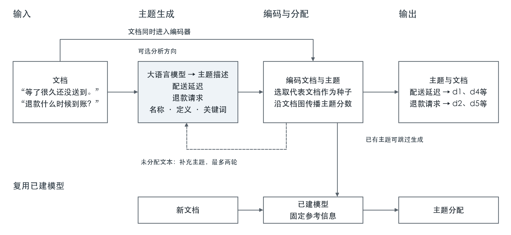

# Hybrid Topic：结合大语言模型主题生成与图传播的主题建模系统

Jiashuo Ren  
University of Stirling

## 摘要

主题建模帮助研究者从大量文本中发现并组织主题。大语言模型能够生成易于阅读的主题名称与描述，为构建可解释、可调整的主题建模工具提供了基础。本文提出 Hybrid Topic，将大语言模型的主题生成能力与预训练语义嵌入、图传播分配相结合。系统根据主题描述选择代表文档，在相似文档之间传播主题分数，并对未分配材料进行有限轮次的主题补充。建模结果可以保存并用于新文档分配，无需再次调用主题生成模型。我们在四份此前用于开发的语料子集上，分别使用两种生成模型进行五次重复实验。GPT-4.1 mini 与 Luna 配置分别在三份和四份语料的 HMP 上超过所用 BERTopic 基线，文档覆盖率为 93.88%—100%。固定主题集合的组件实验表明，图传播总体上提高了 HMP 与覆盖率。Hybrid Topic 通过统一的 Python 接口连接主题发现、用户提供主题和新文本分析，为使用自然语言主题组织文本提供了可复用的系统实现。提示词比较表明，精简措辞产生的平均主题数较少，分组质量的变化则因语料而异。

**关键词：** 主题建模、大语言模型、语义嵌入、图传播。

## 1. 引言

主题建模旨在发现文本集合中反复出现的主题，并据此组织文档。面对社交媒体评论、新闻报道等材料，研究者可以借助主题建模了解主要议题、查阅相关文本，并形成进一步分析的线索。主题是否容易理解、文档是否被合理分组，以及生成的主题能否用于后续材料，都会影响这一过程。

已有研究从不同角度处理这些需求。概率主题模型从词语分布中推断潜在主题，语义嵌入方法则利用预训练表示组织文档。大语言模型进一步使主题能够以名称和自然语言描述呈现，也为用户指定分析方向提供了便利。如何将这些描述与文档的语义关系结合，是构建主题建模系统的一项具体设计问题。

研究者还需要在初次分析后继续使用结果。例如，分析评论时，可以阅读某个主题下的文本，导出它们进行更细致的分析，再将相同主题用于新收集的评论。Hybrid Topic 将这些步骤组织在同一个系统中。

近期方法已经探索这种结合。TopicGPT 使用语言模型生成主题并分配文档（Pham et al., 2024）；LiSA 将生成的主题信息引入文档与主题两个语义空间，协调聚类结果（Liu et al., 2025）。这些研究表明，生成的主题信息可以参与文档组织。本文考察利用固定的预训练语义表示和文档之间的连接，完成从主题描述到文档分配的过程。

本文提出 Hybrid Topic。大语言模型负责发现和命名主题，编码器将主题描述与文档映射到共同语义空间，图传播则利用相似文档之间的关系分配主题。系统还支持用分析方向引导生成、使用已有主题集合，以及保存模型后独立分配新文本。主题生成与后续文档分配的分工，使已经形成的主题方案能够持续使用。

我们在四份语料上比较两种生成器配置与聚类基线，并通过固定主题集合的传播开关实验考察传播步骤的作用。两种配置分别在三份和四份语料的 HMP 上超过所用 BERTopic 基线；图传播总体改善了 HMP 与覆盖率。本文的贡献在于连接生成式主题描述、语义表示和图分配的系统实现，以及对其文档分组表现、传播贡献和生成模型影响的实证分析。

## 2. 相关研究

### 2.1 从词统计到语义表示

概率主题模型通过词语在文档中的分布推断主题。LDA 将文档表示为潜在主题的混合，每个主题对应一个词分布（Blei et al., 2003）。这种表示为大规模文本探索提供了基础，但短文本包含的词语及其共现关系较少。BTM 针对这一问题，在整个语料中建模无序词对的共现，以缓解单篇短文本中的统计稀疏（Yan et al., 2013）。这些方法关注词分布与共现规律，为主题发现建立统计依据。

预训练语义表示为主题建模提供了另一类信息。上下文化主题模型将上下文文档表示引入神经主题建模（Bianchi et al., 2021）；BERTopic 对文档嵌入聚类，再通过基于类别的 TF-IDF 提取描述聚类的特征词（Grootendorst, 2022）。语义表示使表达不同但含义相关的文本能够在向量空间中接近。不同方法仍各有适用条件，而预训练编码器也为结合主题描述与文档关系提供了直接途径。

### 2.2 大语言模型辅助主题建模

大语言模型将主题表示扩展为名称、定义及其他自然语言描述，并支持以提示表达分析需求。TopicGPT 通过主题生成、细化和文档分配组织这一过程；分配阶段还提供支持判断的原文引句。其研究报告了与人工类别的对齐改善，并展示了通过用户约束调整主题的能力（Pham et al., 2024）。这使主题成为可供分析者检查和调整的明确描述。

生成信息也可以与语义聚类结合。LiSA 为文档生成候选主题词，建立文档与主题两个语义空间，通过语言模型协调冲突分配，并训练预测网络对齐两种空间。该研究在主题对齐上取得了优于其所测 GPT-4 方法的结果，在主题质量上与神经主题模型具有竞争力（Liu et al., 2025）。Hybrid Topic 同样利用生成的主题信息组织文档，其分配阶段采用固定表示上的图传播。

### 2.3 图关系与主题分配

单篇文档与主题描述之间的相似度提供了直接的语义依据，文档之间的关系则提供额外的分配线索。基于图的半监督学习利用样本邻接结构传播已有信息，使预测与数据结构保持一定的一致性（Zhou et al., 2003）。在主题建模中，HAMLET 将语言模型、语义嵌入和图神经网络结合，用于跨语言医疗文本的主题建模与主题表示细化（Sakai & Lam, 2025）。

Hybrid Topic 根据文档与生成主题的相似度选择种子，再将种子的主题分数传给相似文档。本文将这种反复传递分数的过程称为图传播或扩散，编码器在整个过程中保持固定。传播实验检验相邻文档提供的信息是否有助于分配。

这一设计将两种语义关系用于不同环节：文档与主题的关系决定初始主题信息放在哪里，文档之间的关系决定信息如何传递。生成主题为文档图提供明确的语义起点，语料内部的邻接结构参与形成最终分组。这也使传播步骤能够在固定主题集合和表示的条件下单独考察。

### 2.4 主题建模评价

主题建模评价涉及主题内容和文档分组两个方面。主题一致性指标考察主题词之间的关联，人工评价则可以进一步判断主题是否可读、具体且有助于理解语料。Hoyle et al.（2021）发现，一致性指标的排序可能与人工评价不一致；Li et al.（2025）进一步指出，语言模型生成的描述即使易读，也可能过于笼统。自然语言主题的分析价值因而需要结合实际任务判断。

外部分组指标将模型输出与参考类别比较。集合匹配类 F 指标为每个参考类别寻找精确率与召回率结合最好的预测分组，再按类别大小加权（Amigó et al., 2009）；本文将这一具体形式记为 HMP。ARI 衡量文档对的分组一致性并校正随机一致的影响（Hubert & Arabie, 1985），NMI 衡量两种划分共享的信息并进行归一化（Vinh et al., 2010）。这些指标提供不同角度的分组证据。

本文以 HMP 为主指标，ARI 和 NMI 为辅助指标，并报告获得主题分配的文档比例，即覆盖率。覆盖率使允许未分配的系统与全量分配的方法能够同时展示分组表现和实际分配范围。精确定义与未分配文档的评分规则见第4.4节。

## 3. 系统与方法

### 3.1 总体框架

给定一组建模文档，Hybrid Topic 生成主题集合并为文档分配主题。每个主题包含名称、定义和关键词，组成系统使用的主题编码表；每篇文档得到一个主题编号，未分配时记为 −1。用户可指定分析方向，或直接提供已有主题。生成器与编码器均保持预训练权重不变。

*图1. Hybrid Topic 的总体框架。文档与主题描述共同进入语义编码和图分配；提供已有主题时跳过生成。未分配的建模文档可触发有限轮次的主题补充。新文档通过已建模型独立获得分配。卡片给出主题与文档的例子。*

### 3.2 主题生成

生成模型读取一组文档，提出其中反复出现的主题。提示词要求模型自行确定主题数量，并为每个主题提供名称、定义和关键词。实验请求中的核心要求如下，以下为原文的中文翻译：

> 自行发现一组精简的、反复出现的主题。每个主题都必须提供名称、定义以及所有有用的核心关键词。

“精简”（compact）鼓励模型形成便于浏览的主题概览，以较概括的主题组织文本；“反复出现”（recurring）则要求关注多篇文档共有的内容。这一措辞表达了概括整理的偏好，具体主题数量仍由模型决定。系统将其作为默认要求，第5.4节进一步比较较为中性的表达。

提示词同时规定以 JSON 返回主题标识及上述三个字段。系统检查这些字段是否完整、有效，再将主题描述送入编码器。生成输入不包含参考标签、基准类别名称或预设主题数，主题及其详细程度由模型根据所给文本判断。

三个字段分别说明主题的不同方面。名称提供简短标签，定义解释主题涵盖什么内容，关键词列出典型表达。例如，“配送延迟”的定义可以涵盖包裹晚于预期到达，关键词包括配送、物流和等待。系统将这些内容组合为主题描述，用于寻找与该主题相近的文档。

用户可以在提示词中补充分析方向。例如，分析产品评论时，可以要求模型重点关注投诉。已经有分类方案的用户也可以直接提供主题名称、定义和关键词。两种方式得到的主题都进入相同的文档分配过程。

候选文档能够放入输入预算时，系统将其全部送入生成模型；超过预算时，按固定随机顺序选择预算内能够容纳的完整文档。未进入生成请求的文档仍参与编码和分配。本次实验中，每次生成调用都纳入了全部候选文档。完整提示词、输入预算和格式重试规则见补充材料。

### 3.3 基于图传播的文档分配

文档分配首先要找到与生成主题相近的文本。系统将主题名称、定义和关键词组合起来，使用同一语义编码器处理主题描述和文档，再通过余弦相似度比较它们的语义。每个主题选择相似度最高的五篇文档作为种子。种子文档以非负相似度作为该主题的初始分数，其他文档的初始分数为零。同一篇文档可以成为多个主题的种子。

系统也比较文档之间的相似度，将语义足够接近的文档连接起来。每篇文档是一个节点，这些连接共同构成文档图。更新主题分数时，更相似的邻居作出更大的贡献。具体连接阈值和更新设置见第4.2节。

*图2. 主题分数从选定的种子文档传播到相似文档。上层箭头表示为一个生成主题选择种子，下层箭头表示向邻近文档传播。底层颜色区分图中三个种子周围的文档组。*

图2展示了生成主题如何通过种子与文档建立联系。系统先找出较直接表达主题含义的文档，再沿相似文档之间的连接传递主题分数。例如，一条关于包裹逾期的评论可能被选为“配送延迟”的种子。与它相连的物流查询评论可以通过这一连接获得同一主题的分数。后续更新使这些信息能够沿文档图继续传播。

每次更新时，系统将邻居主题分数的加权平均与文档的初始种子分数组合。保留初始分数使传播持续受到生成主题的引导。更新持续到分数变化很小，或达到设定的更新次数。每篇文档选择分数最高且为正的主题，没有正分的文档保持未分配。所有主题都经过这一过程，因此系统可以比较一篇文档在不同主题上的分数，形成最终分配。

未分配文档可能包含初始主题集合遗漏的内容。当至少有两篇文档未分配时，生成模型会同时接收这些文档和完整的现有主题表。提示词要求找出当前主题表尚未涵盖的重复主题，并保留已有主题。系统检查新增主题是否重复，纳入有效主题后，使用保存的文档向量和相似度重新分配。补充最多进行两轮；没有有效新增主题或满足其他停止条件时提前结束。完整提示词及停止规则见补充材料。用户直接提供主题集合时，系统从文档分配开始处理。

### 3.4 新文档分配与模型复用

拟合后的模型保存参考文档向量、最终主题分数和相似度阈值。对于每篇新文档，系统找出相似度为正且达到阈值的参考文档，按相似度对它们的主题分数求加权平均，再乘以传播系数。新文档获得正分最高的主题；没有正分时保持未分配。

每篇新文档独立使用同一组保存的参考信息。在编码和预处理保持一致且具有确定性的条件下，同一篇文本单独提交或与其他文本一起提交，都会获得相同分配。研究者因此可以将已经建立的主题集合用于后续收集的材料。主题发现需要调用生成模型，后续分配则使用保存的模型和编码器。

### 3.5 系统使用流程

分析从 Python 或 Jupyter 中的一组文本开始。用户配置生成模型和编码器后拟合模型，得到主题表及文档分配结果。主题表列出名称、定义、关键词和文档数量，文档表则将具体文本与其分配对应起来，方便研究者阅读每个主题下的材料。

例如，研究者分析新闻时，可以先查看语料中的主要议题，再阅读某个主题下的文章。导出的表格支持后续筛选和分析，保存的模型则使新增文章能够沿用相同的主题方案。自动发现、指定分析方向和提供已有主题集合都使用这套检查与复用流程。仓库提供安装说明和完整的 Python 使用示例。

## 4. 实验设计

### 4.1 语料及其来源

表1列出固定子集。Bills 来自 TopicGPT 研究仓库（Pham et al., 2024）。SIB-200 是多语言主题分类资源（Adelani et al., 2024）。MASSIVE 包含多语言助手交互话语（FitzGerald et al., 2022），本文使用 SetFit 提供的中英文场景分类版本。AG News 使用 Zhang et al.（2015）相关的文本分类基准。

*表1. 建模语料与测试语料。列出建模、测试及最终纳入评分的文档数量。*

| 语料 | 材料 | 建模文本 | 测试文本 | 纳入评分 |
|---|---|---:|---:|---:|
| Bills | 立法文本，保存的 TopicGPT 子集 | 272 | 376 | 376 |
| SIB-200 | 中英文主题分类文本 | 210 | 140 | 140 |
| MASSIVE | 中英文助手话语，场景标签 | 540 | 360 | 360 |
| AG News | 新闻分类文本 | 1,200 | 800 | 799 |

子集根据参考类别进行均衡抽样。SIB-200 和 MASSIVE 先合并中英文，再按每个类别抽取三十条建模记录和二十条测试记录，随机种子为十一；没有强制两种语言数量相等。Bills 保留满足既定最少记录数量规则的类别。具体获取路径与已记录版本见[复现说明](../docs/REPRODUCIBILITY.md)。

按照事先固定的重叠规则，AG News 中一条测试文本被排除在主要评分之外。该规则先筛选字符五元组 TF-IDF 相似度至少为 0.70 的文本对，再排除五元组 Jaccard 相似度至少为 0.80 的文本对。包含全部八百篇测试文档的结果见补充材料。

生成器不接收参考标签；文档预测完成后使用标签评分。四份语料此前均用于开发，本次实验在保留的建模与测试划分内评价留出文档的分配。

### 4.2 模型与共享设置

两种生成模型分别为 GPT-4.1 mini（`gpt-4.1-mini-2025-04-14`）与 Luna（`gpt-5.6-luna`，推理强度为 `low`）。每种配置在每份语料上运行五次，共四十次拟合。两种生成器采用相同的默认分配参数，重复生成用于观察输出变化。

所有比较共用 Qwen3-Embedding-0.6B 的文档向量（Qwen, n.d.）；每次生成的主题描述分别编码。编码输入上限设为512个token，测试文档逐篇编码。文档图保留达到不同文档两两相似度第95百分位数的连接，去除自身连接，并将每行正权重除以其总和。每主题选择五个种子，每次更新中邻居分数占70%、初始分数占30%；最多更新十次，最大绝对变化不超过0.000001时提前停止。主题补充最多两轮。生成预算、完整运行配置与复现入口见补充材料。

采用分位阈值可以根据每份语料内部的相似度分布筛选连接。P95大致保留相似度最高的5%文档对，相似度并列时比例会略有变化，使传播集中在语义关系较强的文档之间。95这一具体分位值是在开发阶段确定并冻结的经验默认，四份语料均使用相同设置。

### 4.3 基线与组件比较

主比较使用 BERTopic 和主题数匹配的 KMeans。KMeans 采用十次初始化，主题数 等于对应 Hybrid 运行的最终主题数。BERTopic 的 UMAP 使用余弦距离、五个分量、十五个邻居和零最小距离；HDBSCAN 的最小簇大小为十，并启用新文档预测。两种生成器配置共享同一组二十次 BERTopic 基线结果；各自的 KMeans 按对应主题数拟合。

传播实验固定每次运行的最终主题集合、文档与主题向量、种子矩阵、相似度阈值及新文档查询规则。开启传播时使用最终参考分数，关闭传播时使用初始种子分数，两者使用相同的分数缩放和正分分配规则。两种生成器、四份语料、每份五次，共形成四十组配对比较。

补充分析另比较最近主题余弦分配与主题补充前后的结果。最近主题分配使用对应运行的同一主题集合，总是选择一个最近主题；主题补充比较使用同次拟合的初始与最终主题集合。完整设置与结果见补充材料。

### 4.4 评价指标

主指标 HMP 将每个参考类别与预测分组比较，选出最匹配的一组（Amigó et al., 2009，第4.1节）。对于每种配对，精确率表示预测分组中有多少文档属于该参考类别，召回率表示该组包含了参考类别中的多少文档。F1 以调和平均结合这两个比例。HMP 取每个类别的最佳 F1，再按类别包含的文档数量加权平均。

覆盖率表示获得主题分配的文档比例。ARI 比较文档对的分组一致性，并校正随机一致的影响。NMI 衡量参考类别与预测分组共享的信息，本文使用两种划分熵的算术平均进行归一化。这些指标分别说明结果的不同方面：HMP、ARI 和 NMI 评价分组情况，覆盖率说明多少文本获得了分配。

全体测试集评分将未分配标签 −1 视为一个共享预测分组，因此同时报告 HMP 与覆盖率。表格采用五次运行的均值与样本标准差；传播比较按同次运行配对。共同已分配子集的结果作为补充诊断，完整逐次指标见补充材料。

## 5. 结果

### 5.1 文档分组与覆盖率

表2报告主比较的 HMP 与覆盖率。GPT-4.1 mini 在 Bills、SIB-200 和 AG News 上的平均 HMP 高于所用 BERTopic 基线，Luna 在四份语料上均更高。两种配置的覆盖率均为0.9388至1.0000，在 SIB-200、MASSIVE 和 AG News 上高于 BERTopic；Bills 上则为0.9388，低于 BERTopic 的0.9750。

*表2. 主结果，数值为五次运行的均值±样本标准差。BERTopic 为共享基线；KMeans 的主题数分别匹配对应生成器配置。*

<!-- main-table:start -->
| 语料 | 配置 | HMP | 覆盖率 |
|---|---|---:|---:|
| Bills | Hybrid / GPT-4.1 mini | 0.3647 ± 0.0301 | 0.9388 ± 0.0000 |
| Bills | Hybrid / Luna | 0.4181 ± 0.0154 | 0.9388 ± 0.0000 |
| Bills | BERTopic（共享） | 0.1603 ± 0.0330 | 0.9750 ± 0.0559 |
| Bills | KMeans / GPT-4.1 mini K | 0.4075 ± 0.0289 | 1.0000 ± 0.0000 |
| Bills | KMeans / Luna K | 0.4172 ± 0.0297 | 1.0000 ± 0.0000 |
| SIB-200 | Hybrid / GPT-4.1 mini | 0.5009 ± 0.0442 | 0.9643 ± 0.0000 |
| SIB-200 | Hybrid / Luna | 0.4759 ± 0.0145 | 0.9643 ± 0.0000 |
| SIB-200 | BERTopic（共享） | 0.2543 ± 0.0055 | 0.0657 ± 0.0340 |
| SIB-200 | KMeans / GPT-4.1 mini K | 0.5226 ± 0.0531 | 1.0000 ± 0.0000 |
| SIB-200 | KMeans / Luna K | 0.5066 ± 0.0440 | 1.0000 ± 0.0000 |
| MASSIVE | Hybrid / GPT-4.1 mini | 0.4896 ± 0.0310 | 0.9500 ± 0.0000 |
| MASSIVE | Hybrid / Luna | 0.6608 ± 0.0236 | 0.9500 ± 0.0000 |
| MASSIVE | BERTopic（共享） | 0.5867 ± 0.0320 | 0.6922 ± 0.0297 |
| MASSIVE | KMeans / GPT-4.1 mini K | 0.5769 ± 0.0424 | 1.0000 ± 0.0000 |
| MASSIVE | KMeans / Luna K | 0.6760 ± 0.0149 | 1.0000 ± 0.0000 |
| AG News | Hybrid / GPT-4.1 mini | 0.7177 ± 0.0454 | 1.0000 ± 0.0000 |
| AG News | Hybrid / Luna | 0.6262 ± 0.0513 | 1.0000 ± 0.0000 |
| AG News | BERTopic（共享） | 0.5692 ± 0.0606 | 0.6889 ± 0.1037 |
| AG News | KMeans / GPT-4.1 mini K | 0.6102 ± 0.0759 | 1.0000 ± 0.0000 |
| AG News | KMeans / Luna K | 0.4795 ± 0.0502 | 1.0000 ± 0.0000 |
<!-- main-table:end -->

与主题数匹配的 KMeans 相比，两种生成器配置在 AG News 上的 HMP 更高；Luna 在 Bills 上也略高。KMeans 在其他组合上取得更高 HMP，并始终分配全部文档。最近主题分配在部分语料上也具有竞争力，其完整结果见补充材料。

### 5.2 图传播的贡献

在固定主题集合的条件下，图传播总体上提高了 HMP 与覆盖率（表3）。两种生成器在 AG News、MASSIVE 和 SIB-200 上的平均 HMP 均有所提高，Bills 上基本持平；所有组合的覆盖率均上升。

*表3. 固定主题集合的传播开关比较。HMP 为五次运行的均值±样本标准差，覆盖率列为五次均值；覆盖率标准差和逐次配对结果见补充材料。*

<!-- propagation-table:start -->
| 生成器 | 语料 | 关闭传播 HMP | 开启传播 HMP | 覆盖率：关闭 → 开启 |
|---|---|---:|---:|---:|
| GPT-4.1 mini | Bills | 0.3640 ± 0.0246 | 0.3647 ± 0.0301 | 0.7755 → 0.9388 |
| GPT-4.1 mini | SIB-200 | 0.4859 ± 0.0374 | 0.5009 ± 0.0442 | 0.6986 → 0.9643 |
| GPT-4.1 mini | MASSIVE | 0.4548 ± 0.0288 | 0.4896 ± 0.0310 | 0.7211 → 0.9500 |
| GPT-4.1 mini | AG News | 0.5382 ± 0.0443 | 0.7177 ± 0.0454 | 0.7697 → 1.0000 |
| Luna | Bills | 0.4228 ± 0.0313 | 0.4181 ± 0.0154 | 0.8596 → 0.9388 |
| Luna | SIB-200 | 0.4490 ± 0.0191 | 0.4759 ± 0.0145 | 0.8100 → 0.9643 |
| Luna | MASSIVE | 0.6370 ± 0.0200 | 0.6608 ± 0.0236 | 0.8428 → 0.9500 |
| Luna | AG News | 0.4823 ± 0.0338 | 0.6262 ± 0.0513 | 0.8583 → 1.0000 |
<!-- propagation-table:end -->

AG News 的平均 HMP 增幅最大，GPT-4.1 mini 与 Luna 分别提高0.1795和0.1438；MASSIVE 分别提高0.0347和0.0238。这两个数据集在两种生成器的五次运行中均表现为正向变化。覆盖率的平均增幅介于7.93和26.57个百分点之间。共同已分配子集的辅助结果见补充材料。

### 5.3 生成模型的影响

Luna 在 Bills 和 MASSIVE 上获得更高 HMP，GPT-4.1 mini 在 SIB-200 和 AG News 上更高。两种生成器的覆盖率在各数据集上相同。两种生成器的相对表现因此随语料而变化。

MASSIVE 上的保存结果进一步展示了主题集合的变化。GPT-4.1 mini 在五次运行中生成的最终主题数为11、11、11、11和14，Luna 对应为24、28、22、28和24。按照既定运行顺序查看第一组输出，GPT-4.1 mini 的“Alarms and Reminders”定义同时涵盖闹钟、提醒及日历事件；Luna 分别生成“闹钟与定时提醒”和“日历、会议与事件安排”。前者的“News and Social Media”涵盖新闻更新和社交媒体操作，后者则分别形成“新闻与时事资讯”和“社交媒体操作与动态”。这组输出具体展示了主题范围和粒度的变化。对应主题原文及运行标识见补充材料。

额外主题发现对本次测试结果的影响较小，补充前后的覆盖率没有变化。完整的初始与最终主题集合比较见补充材料。

### 5.4 主题生成提示词的影响

我们将主实验中的精简提示词与较为中性的表达进行比较。中性版本的要求为：“识别文档中反复出现的主题。根据文档内容确定主题数量和具体程度。为每个主题提供名称、定义和相关核心关键词。”两种生成器均在相同语料、随机种子、生成设置、分配过程和评分方法下重新完成二十次拟合，共四十次。表4列出五次运行的平均最终主题数及HMP，主题数包含补充阶段加入的主题。

*表4. 精简与中性提示词下的主题数和HMP，每项为五次运行的均值。逐次结果、样本标准差、覆盖率、ARI、NMI及完整对照方法见补充材料。*

| 生成器 | 语料 | 精简：主题数 | 中性：主题数 | 精简：HMP | 中性：HMP |
|---|---|---:|---:|---:|---:|
| 4.1 mini | Bills | 13.6 | 16.8 | 0.3647 | 0.3938 |
| 4.1 mini | SIB-200 | 9.8 | 10.2 | 0.5009 | 0.4889 |
| 4.1 mini | MASSIVE | 11.6 | 21.0 | 0.4896 | 0.5981 |
| 4.1 mini | AG News | 10.6 | 11.6 | 0.7177 | 0.6825 |
| 5.6 Luna | Bills | 21.8 | 25.0 | 0.4181 | 0.4316 |
| 5.6 Luna | SIB-200 | 16.0 | 19.0 | 0.4759 | 0.4707 |
| 5.6 Luna | MASSIVE | 25.2 | 28.0 | 0.6608 | 0.6676 |
| 5.6 Luna | AG News | 16.6 | 22.6 | 0.6262 | 0.4932 |

中性提示词在八个生成器与语料组合中均产生了更多的平均主题数。GPT-4.1 mini在SIB-200上由9.8个增加至10.2个，在MASSIVE上则由11.6个增加至21.0个。Luna在四份语料上的平均主题数也都增加，其中AG News由16.6个增加至22.6个。这些结果支持将精简措辞用于控制主题集合的规模，同时让模型根据文本决定具体数量。

分组质量的变化随语料而异。采用中性提示词后，两种生成器在Bills和MASSIVE上的HMP均提高，在SIB-200和AG News上均降低。提升最大的是GPT-4.1 mini在MASSIVE上的表现，由0.4896提高至0.5981；下降最大的是Luna在AG News上的表现，由0.6262降至0.4932。七个组合的覆盖率保持一致，Luna在Bills上的覆盖率由93.883%略增至93.936%。更细的主题划分有助于部分语料的分组，而较概括的主题在另一些语料中更贴近参考类别。本次比较替换了一组提示语句并重新生成主题，因此结果同时包含措辞变化和生成波动的影响。

## 6. 系统的实际优势

### 6.1 较低的主题生成费用

Hybrid Topic 使用语言模型发现主题并补充遗漏的内容，随后由编码器和图完成文档分配。这一分工使生成调用集中在主题发现阶段。采用精简提示词的主实验中，GPT-4.1 mini 在二十次拟合中发出55次请求，Luna 发出44次。根据运行记录中的历史标准费率，两批生成 API 费用分别估算为0.3440和0.2020美元（表5）。

*表5. 生成 API 费用估算，单位为美元。每批包括四份语料各五次拟合，按记录的 token 用量与历史标准非缓存费率估算；本地编码与图计算另有计算开销。*

| 生成器 | 请求次数 | 整批费用 | 每次拟合均值 |
|---|---:|---:|---:|
| GPT-4.1 mini | 55 | 0.3440 | 0.0172 |
| Luna | 44 | 0.2020 | 0.0101 |

模型保存后，研究者可以通过编码器和已有参考信息，将新文档分配到现有主题。后续批次因此无需再次请求主题生成，适合持续收集新闻或评论的分析。完整 token 用量与估算范围见补充材料。

### 6.2 可以直接阅读的主题描述

每个主题都有名称、定义和关键词。名称帮助读者快速了解议题，定义说明涵盖哪些内容，关键词提供常见表达。研究者还可以查看已分配文档，检查描述与具体材料的关系。

例如，Luna 在 MASSIVE 上生成的“日历、会议与事件安排”，其定义涵盖创建、查看、修改或删除会议、约会、生日、聚会等日程事件。这样的描述直接说明了主题范围，方便研究者判断它是否与分析问题有关，也便于检查它与“闹钟与定时提醒”的区别。

### 6.3 文档分组表现与覆盖率

实验表明，可读的主题描述能够与较好的文档分组表现结合。GPT-4.1 mini 在四份语料中的三份上取得高于所用 BERTopic 基线的 HMP，Luna 在四份上均更高，两种配置的覆盖率达到93.88%—100%。这些结果同时体现了与参考类别的吻合程度，以及对大部分文档的主题分配。

覆盖率对后续阅读也有实际意义：获得分配的文档可以按主题检索，较少材料留在主题方案之外。传播实验显示了图在其中的作用，所有组合的覆盖率均提高，HMP 总体改善。表2保留包括主题数匹配 KMeans 在内的完整比较，表3单独呈现传播的贡献。

### 6.4 分析控制与持续使用

提示词比较也说明，生成要求可以影响主题的详细程度。精简的主题集合便于研究者初步浏览和理解语料；需要关注宽泛主题内部差异时，更细的划分也有价值，MASSIVE的结果提供了这一例子。默认要求侧重形成便于把握的概览，用户也可以通过分析方向表达更具体的研究重点。

研究者可以自动发现主题，指定分析方向，或直接提供已有主题方案。这些选择对应不同的研究需要：自动发现用于探索陌生材料，分析方向使主题生成围绕研究问题展开，已有主题方案则用于按既定类别组织文档。

主题表和文档表支持检查与导出，保存的模型可以在新增材料到来时重新使用。新文档独立参照已保存的信息获得分配，使相同主题方案能够跨批次使用。这些功能将初步了解语料与后续筛选、阅读和整理文本的工作连接起来。

## 7. 讨论

### 7.1 传播带来了什么变化

采用精简提示词主题集合的传播实验显示了两种变化：更多文档获得主题分配，分组总体上也更接近参考类别。两种生成器在 AG News 和 MASSIVE 的五次运行中都提高了 HMP。这些结果支持利用文档之间的联系，将生成主题提供的信息扩展到更多文本。

不同语料的改善程度有所差异。在 Bills 上，传播提高覆盖率，平均 HMP 则接近原有水平；在 AG News 上，传播为全部测试文档分配主题，同时带来最大的 HMP 增幅。查看两种设置下都获得分配的文档，有助于区分分组变化和覆盖变化。在这个共同子集上，HMP 增幅通常较小，但 AG News 和 MASSIVE 的平均变化仍为正。SIB-200 则更容易受到哪些文档获得分配的影响。因此，结合 HMP 与覆盖率，可以比单看一个指标更清楚地理解传播的作用。

生成器决定了这一过程从哪些主题开始。在 MASSIVE 的例子中，GPT-4.1 mini 将闹钟、提醒和日历事件放在一个主题中，Luna 则将日历活动与闹钟、定时提醒分开。这些选择改变了用于寻找种子的主题描述，具体展示了不同生成器如何将同一批文档组织成不同分组。

提示词比较进一步呈现了概括与细分之间的取舍：两种生成器的平均主题数增加后，Bills和MASSIVE的HMP提高，SIB-200和AG News的HMP降低。合适的详细程度与语料内容及分析目的有关。系统保留精简提示词作为默认，以提供便于浏览的概览，同时完整呈现更细划分表现较好的情形。

### 7.2 局限

评价基于四份此前用于开发的小型固定子集，反映这些划分内的留出分配表现。基线范围有限，BERTopic 在 SIB-200 上的低覆盖率也影响了比较；近期 LLM 主题方法尚未在同一协议下直接评估。传播开关实验固定的是完整系统已生成的最终主题集合，刻画这一条件下的传播贡献，不能据此断言完整图分配优于最近主题分配；后者的比较见补充材料。

当前图实现需要存储稠密相似度矩阵，存储量随文档数平方增长。实验编码长度与语料规模限制了对长文档和大规模运行的判断；上下文受限时的生成抽样尚未实测。本文评价中英文子集，尚未验证其他语言或本地生成配置的质量。

系统每篇文档输出一个主题或未分配标记，传播分数没有经过概率校准。外部类别提供一种分组参照；主题名称和描述在实际分析中的效用仍需用户研究评价。

## 8. 结论

本文提出 Hybrid Topic，将大语言模型主题生成、预训练语义嵌入和图传播连接为可复用的主题建模系统。在四份语料上，两种生成器配置分别在三份和四份语料的 HMP 上超过所用 BERTopic 基线，覆盖率达到93.88%—100%。固定主题集合的实验表明，图传播总体上改善了 HMP 与覆盖率。系统支持自动发现主题、用户提供主题方案以及新文档分配，为以自然语言主题组织和持续分析文本提供了统一的实现。提示词比较支持以精简要求形成主题概览，并呈现出更细划分对部分语料的帮助。

## 数据与软件可用性

[补充材料](supplementary_material.md)提供额外比较、完整设置及评价版本说明。[复现指南](../docs/REPRODUCIBILITY.md)介绍文档级编码预测包，可在无需原文或API调用的情况下重算HMP、覆盖率、ARI和NMI。完整生成与保存模型的复现还需要指南列出的输入和依赖。

## 伦理与数据处理

实验使用现有基准语料。云端生成会把选定文本传送给配置的提供商，用户应根据数据隐私要求选择材料和服务。发布材料须遵守数据集署名和再分发条件。导出的文档表包含原文，保存的模型包含参考向量，两者都需要适当的访问控制。

## AI 辅助使用说明

项目编码、调试、实验审计及论文起草使用了 AI 辅助。

## 参考文献

Adelani, D. I., Liu, H., Shen, X., Vassilyev, N., Alabi, J. O., Mao, Y., Gao, H., & Lee, E.-S. A. (2024). SIB-200: A simple, inclusive, and big evaluation dataset for topic classification in 200+ languages and dialects. *Proceedings of EACL*, 226–245. [doi:10.18653/v1/2024.eacl-long.14](https://doi.org/10.18653/v1/2024.eacl-long.14).

Amigó, E., Gonzalo, J., Artiles, J., & Verdejo, F. (2009). A comparison of extrinsic clustering evaluation metrics based on formal constraints. *Information Retrieval, 12*, 461–486. [doi:10.1007/s10791-008-9066-8](https://doi.org/10.1007/s10791-008-9066-8).

Bianchi, F., Terragni, S., & Hovy, D. (2021). Pre-training is a hot topic: Contextualized document embeddings improve topic coherence. *Proceedings of ACL-IJCNLP, Volume 2*, 759–766. [doi:10.18653/v1/2021.acl-short.96](https://doi.org/10.18653/v1/2021.acl-short.96).

Blei, D. M., Ng, A. Y., & Jordan, M. I. (2003). Latent Dirichlet allocation. *Journal of Machine Learning Research, 3*, 993–1022. [Publisher page](https://www.jmlr.org/papers/v3/blei03a.html).

FitzGerald, J., Hench, C., Peris, C., Mackie, S., Rottmann, K., Sanchez, A., Nash, A., Urbach, L., Kakarala, V., Singh, R., Ranganath, S., Crist, L., Britan, M., Leeuwis, W., Tur, G., & Natarajan, P. (2022). MASSIVE: A 1M-example multilingual natural language understanding dataset with 51 typologically-diverse languages. *arXiv*. [doi:10.48550/arXiv.2204.08582](https://doi.org/10.48550/arXiv.2204.08582).

Grootendorst, M. (2022). BERTopic: Neural topic modeling with a class-based TF-IDF procedure. *arXiv*. [doi:10.48550/arXiv.2203.05794](https://doi.org/10.48550/arXiv.2203.05794).

Hoyle, A., Goel, P., Peskov, D., Hian-Cheong, A., Boyd-Graber, J., & Resnik, P. (2021). Is automated topic model evaluation broken? The incoherence of coherence. *arXiv* (NeurIPS 2021 paper). [doi:10.48550/arXiv.2107.02173](https://doi.org/10.48550/arXiv.2107.02173).

Hubert, L., & Arabie, P. (1985). Comparing partitions. *Journal of Classification, 2*, 193–218. [doi:10.1007/BF01908075](https://doi.org/10.1007/BF01908075).

Li, Z., Calvo-Bartolomé, L., Hoyle, A., Xu, P., Stephens, D., Dima, A., Fung, J. F., & Boyd-Graber, J. (2025). Large language models struggle to describe the haystack without human help: A social science-inspired evaluation of topic models. *Proceedings of ACL*, 7583–7604. [doi:10.18653/v1/2025.acl-long.375](https://doi.org/10.18653/v1/2025.acl-long.375).

Liu, J., Shang, Z., Ke, W., Wang, P., Luo, Z., Liu, J., Li, G., & Li, Y. (2025). LLM-guided semantic-aware clustering for topic modeling. *Proceedings of ACL*, 18420–18435. [doi:10.18653/v1/2025.acl-long.902](https://doi.org/10.18653/v1/2025.acl-long.902).

Pham, C. M., Hoyle, A., Sun, S., Resnik, P., & Iyyer, M. (2024). TopicGPT: A prompt-based topic modeling framework. *Proceedings of NAACL*, 2956–2984. [doi:10.18653/v1/2024.naacl-long.164](https://doi.org/10.18653/v1/2024.naacl-long.164).

Qwen. (n.d.). *Qwen3-Embedding-0.6B* [Model card]. Retrieved September 8, 2026, from [the model repository](https://huggingface.co/Qwen/Qwen3-Embedding-0.6B).

Sakai, H., & Lam, S. S. (2025). HAMLET: Healthcare-focused adaptive multilingual learning embedding-based topic modeling. *arXiv* [Preprint]. [doi:10.48550/arXiv.2505.07157](https://doi.org/10.48550/arXiv.2505.07157).

Vinh, N. X., Epps, J., & Bailey, J. (2010). Information theoretic measures for clusterings comparison: Variants, properties, normalization and correction for chance. *Journal of Machine Learning Research, 11*, 2837–2854. [Publisher page](https://www.jmlr.org/papers/v11/vinh10a.html).

Yan, X., Guo, J., Lan, Y., & Cheng, X. (2013). A biterm topic model for short texts. *Proceedings of WWW*, 1445–1456. [doi:10.1145/2488388.2488514](https://doi.org/10.1145/2488388.2488514).

Zhang, X., Zhao, J., & LeCun, Y. (2015). Character-level convolutional networks for text classification. *arXiv* (NIPS 2015 paper). [doi:10.48550/arXiv.1509.01626](https://doi.org/10.48550/arXiv.1509.01626).

Zhou, D., Bousquet, O., Lal, T. N., Weston, J., & Schölkopf, B. (2003). Learning with local and global consistency. *Advances in Neural Information Processing Systems, 16*. [Proceedings page](https://proceedings.neurips.cc/paper_files/paper/2003/hash/87682805257e619d49b8e0dfdc14affa-Abstract.html).
